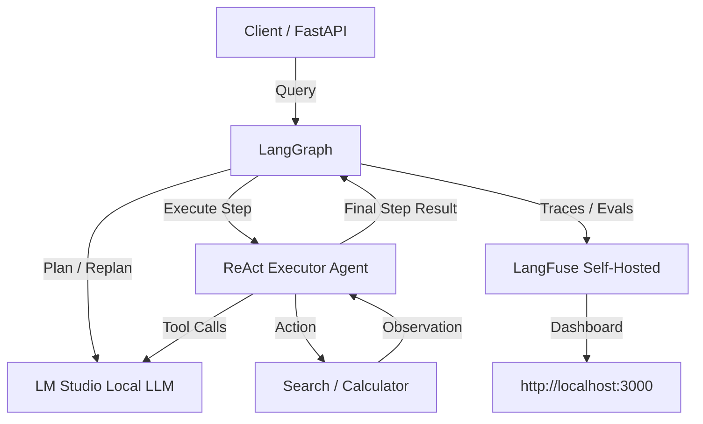
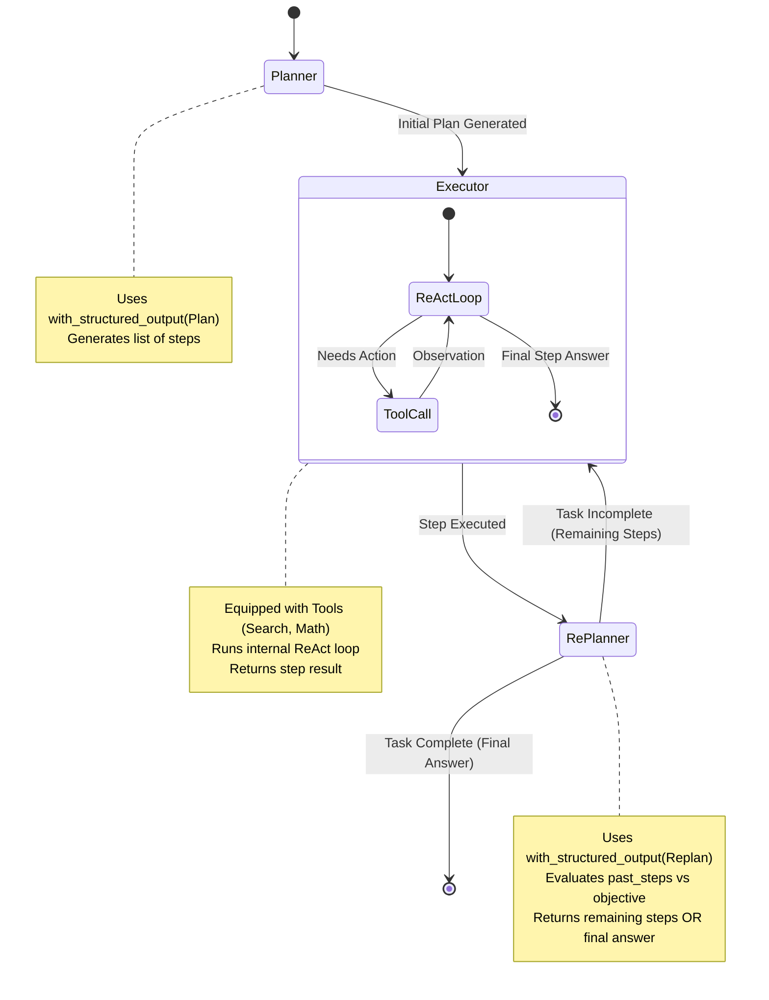
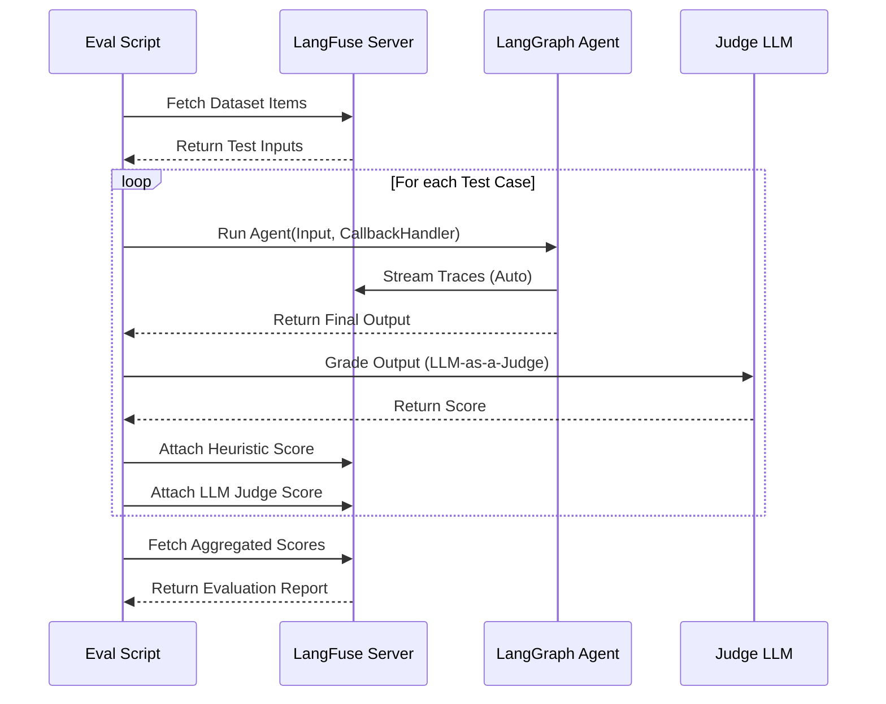

# 🧠 Planning Agent (LangGraph + LM Studio + LangFuse)

A production-ready Plan-and-Execute agent architecture. The agent breaks down complex objectives into a step-by-step plan, executes each step using a **Tool-Calling ReAct Agent**, evaluates progress, and re-plans if necessary.

100% Free and Local. Uses LM Studio for LLM inference and LangFuse for Observability/Evals.

## 🏗️ System Architecture



## 🔄 Agent State Machine Flow

The core of the agent uses LangGraph to route the state through planning, tool-calling execution, and re-evaluation loops.



## 🧪 Evaluation Flow (LangFuse)

How we assess the agent's quality using custom heuristics and LLM-as-a-judge.



## 🚀 Quickstart

### 1. Start LangFuse (Observability)
```bash
docker-compose up -d
```
Go to `http://localhost:3000`, sign up, and generate API keys. Add them to your `.env` file.

### 2. Start LM Studio (LLM Inference)
1. Open LM Studio
2. Download a model (Recommended: `Qwen2.5-7B-Instruct` or `Llama-3.1-8B-Instruct` — both support tool calling!)
3. Go to the "Local Server" tab
4. Load the model and Start Server (default port 1234)

### 3. Install Dependencies (using `uv`)
```bash
# Ensure uv is installed: curl -LsSf https://astral.sh/uv/install.sh | sh
uv sync
```

### 4. Run the FastAPI Server
```bash
uv run uvicorn planning_agent.server:api --reload
```

### 5. Test the API
```bash
curl -X POST http://127.0.0.1:8000/run \
-H "Content-Type: application/json" \
-d '{"query": "Calculate how many seconds are in a year, then convert that to minutes.", "session_id": "user-123"}'
```

### 6. Run Evaluations
```bash
uv run python -m planning_agent.evaluator
```

## 📊 Observability

Every request is automatically traced to your local LangFuse instance.
1. Open `http://localhost:3000`
2. Navigate to **Traces**
3. You will see the full execution flow: Planner call → ReAct Executor inner loops + Tool calls → Replanner call.

## 🛠️ Tech Stack

| Component | Technology | Purpose |
|-----------|------------|---------|
| **Orchestration** | LangGraph | State machine, conditional routing |
| **Execution** | LangGraph Prebuilt ReAct | Tool-calling step executor |
| **Inference** | LM Studio | Local, free LLM hosting (Qwen/Llama/Gemma) |
| **Observability** | LangFuse | Tracing, evaluation, prompt management |
| **API** | FastAPI | Production-ready API server |
| **Config** | Pydantic-settings | Type-safe environment variables |
| **Package Mgr** | uv | Blazing fast Python dependency management |
